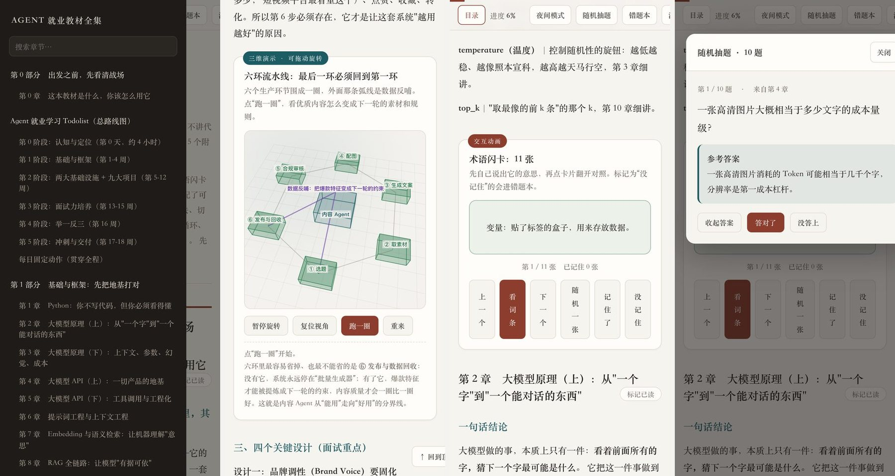
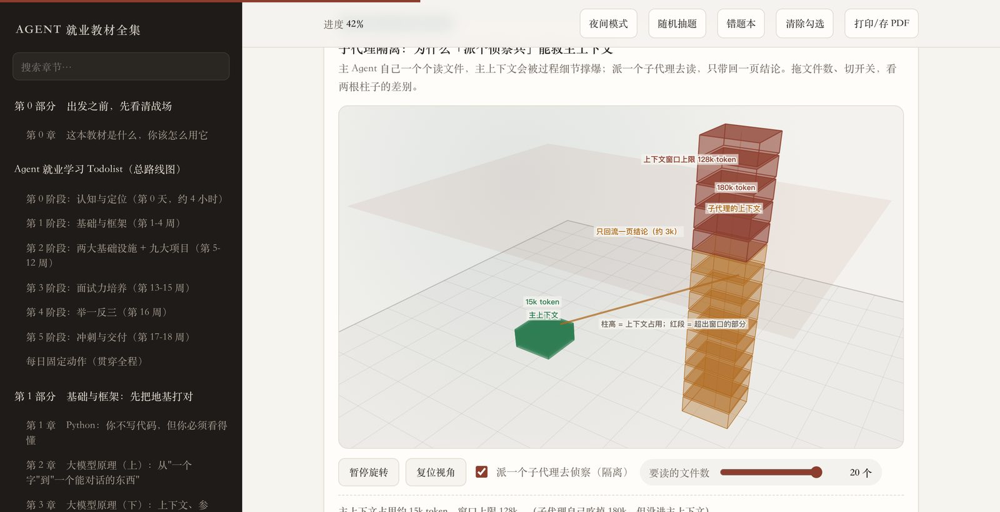
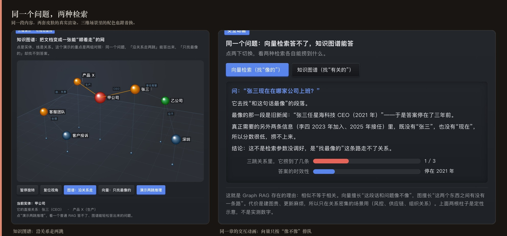
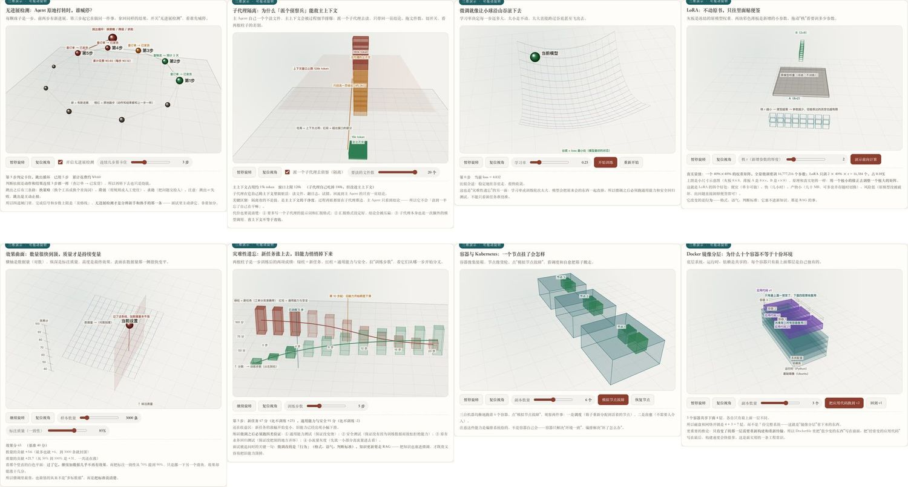

<div align="center">

# Agent 就业教材全集

**一本能离线装进 iPhone 的中文 AI / Agent 就业教材**

34 章正文 · 50 个可拖动旋转的三维演示 · 42 个交互动画<br>
324 道自测题（含答案与错题本）· 266 张术语闪卡 · 18 处面试话术演练



</div>

---

## 这是什么

一本讲 **AI / Agent 方向怎么入门、怎么做出项目、怎么面试** 的教材，被完整封成了一个 App。

- **完全离线**：整本书（含全部交互）都在一个 HTML 文件里，**不请求任何外部资源**，飞行模式下照常看。
- **能在手机上真用**：不是 PDF 缩印。三维演示可以拖着转，自测题能答题并记错题，闪卡能翻面。
- **为"看不懂原理、又买不起课"的人写的**：每个机制都先用生活类比讲一遍，再给面试怎么说的口径。

## 内容

| 模块 | 数量 | 说明 |
| --- | --- | --- |
| 正文 | 34 章 | 从大模型原理、RAG、Harness 一路讲到九个电商项目、简历与面试 |
| 三维演示 | **50 个** | 自写的三维引擎（透视投影 + 深度排序），可拖拽旋转、缩放，多数带参数滑块 |
| 平面交互动画 | **42 个** | 分步演示、可拖的参数、可点的散点；每章一张主图，另有 8 张补在"最容易讲不清"的机制上 |
| 自测题 | **324 道** | 每题都有参考答案；可标记"答对了 / 没答上"，自动进错题本 |
| 术语闪卡 | 266 张 | 先自己说，再翻面对照；"没记住"的进错题本 |
| 面试话术演练 | 18 处 | 参考话术默认遮住，先自己说一遍再看 |
| 学习路线 | 46 项 | 带验收标准的可勾选 Todolist，另附在 HTML 里 |
| 章末导航 | 34 处 | 每章读完有三个按钮：**前往下一章 / 做题 / 写笔记** |
| 写笔记 | 本机保存 | 每章一个输入框，自动保存；只存在设备上，不上传 |
| 问问题 | 接 DeepSeek | 带着**当前这一章的正文**提问，模型是 `deepseek-flash` |
| 皮肤 | **2 套，随时切** | 顶栏「皮肤」→ 经典（暖色纸感）/ 锤子 · Dieter Rams（中性灰阶）。选择记在设备上 |

三维演示是有意做成"能动手"的：微调那一章可以拖学习率看小球滚下山谷；
量化那一章拖位数，能看台阶变粗、显存下降；上下文管理那一章能直接看到
**主上下文只占 15k、子代理自己吃掉 180k**。

交互动画也一样：**拖夹角**能看到余弦相似度从 1.00 走到 −1.00（第 7 章）；
**关掉 Agent 的三道刹车**，能看到它从"4 步 0.20 元"变成"12 步 0.60 元"（第 12 章）；
**拖工具数量**能看到并行调用到底省下多少等待（第 5 章）。

## 装到 iPhone 上

两条路，选一条就行。**都不需要开发者账号。**

### 路 1：AltStore 侧载（推荐）

产出的是**未签名 IPA**，签名由 AltStore 用你自己的 Apple ID 在安装时完成。

1. 打开本仓库的 **Actions** 标签，点最新一次「云端编译 IPA」运行
2. 页面底部 **Artifacts** 里下载 `AgentBook-ipa`，解压得到 `AgentBook.ipa`
3. 用 AltStore 装上（详细步骤见 [`路2-云端编译与侧载.md`](路2-云端编译与侧载.md)）

> **免费 Apple ID 的限制**：同时最多 3 个自签 App；7 天有效期，由 AltStore 连电脑时自动续签；
> Apple ID 需要开双重认证。iOS 16 以上还要在「设置 → 隐私与安全性」最下面手动打开**开发者模式**。

### 路 2：当网页用（PWA）

`web/` 目录就是同一个教材的网页版，可以托管到任意静态空间，或在本机跑起来：

```bash
cd web && python3 -m http.server 8080
```

然后在 Safari 里打开，点分享 → **添加到主屏幕**，它会像 App 一样全屏运行。
Service Worker 会缓存全部内容，之后断网也能读（见 [`安装说明.md`](安装说明.md) 底部）。

## 界面上是什么样

<div align="center">

</div>

左边是全书目录（可搜索），顶部有夜间模式、随机抽题、错题本、清除勾选、打印/存 PDF。
每一章都带三维演示或交互动画，下面还有「动手体验 / 现实校准 / 面试怎么说」。

**顶栏只留这几个**：目录 · 进度 · 日间模式 · 皮肤 · 问问题 · 写笔记。
随机抽题、错题本、清除勾选、打印都挪进了目录抽屉底部的「工具」区 ——
它们不是每天要点的东西，放在那儿更清爽（手机上从「目录」进去就能看到）。

**每章末尾有三个按钮**：前往下一章、做题（只抽这一章的题）、写笔记。
读完一章顺手做完题、写下两句话，比连读三章记得牢得多。

## 关于「问问题」，有一件事必须说清楚

**这个仓库是公开的，所以 API Key 绝对不能写进书里。** 写进去就等于公开 ——
包括放在编译产物里也不行（公开仓库的 Actions 产物，任何登录用户都能下载解包）。

所以这里的设计是：**Key 只存在你自己的设备上**（浏览器 / App 的 localStorage），
第一次打开「问问题」时粘一次，之后一直有效。书的 HTML、仓库、编译产物里都不含 Key。

不想用这个功能也完全没关系 —— 书本身 100% 离线可用，「问问题」是唯一需要联网的地方，
断网时它会给一句人话提示，不会影响阅读。

## 它讲得有多细

不是把概念列一遍，而是把**机制为什么成立**画出来。比如第 11 章那张图，同一个问题给两种走法：
图谱沿关系走两跳能答出来；纯向量检索只按"像不像"排队 ——
**正确答案只排第 5，根本没进前 3**（这个排名是按真实坐标算出来的，不是印上去的）。

<div align="center">

</div>

50 个三维演示的一角（每格一张，都能拖动旋转）：

<div align="center">

</div>

## 仓库结构

| 路径 | 说明 |
| --- | --- |
| `AgentBook/` | SwiftUI 工程；教材本体打包在里面，启动即离线可用 |
| `AgentBook/AgentBook/book.html` | **整本教材（单文件）**，含 50 个三维演示与全部交互 |
| `web/` | 同一份教材的网页版 + `manifest.webmanifest` + `sw.js`（PWA） |
| `docs/` | 本 README 用的截图 |
| `.github/workflows/build-ipa.yml` | 云端编译流水线：推送后自动产出未签名 IPA |
| `路2-云端编译与侧载.md` | 从零开始的侧载步骤 |
| `安装说明.md` | 走 Xcode 本地编译的路线（有 Apple 芯片 Mac 时更省事） |
| `Intel-Mac 备选方案.md` | 三条路的对比与选择 |

## 自己改内容 / 重新发布

正文源文件不在这个仓库里，它是**构建产物**。流程是：

1. 在本地教材项目里改正文或场景，跑构建脚本重新生成 `book.html`
2. 同步进本仓库（覆盖 `AgentBook/AgentBook/book.html` 与 `web/index.html`）
3. 推送 —— Actions 会自动重新编译，几分钟后就能下载新的 IPA

不熟悉命令的话，双击仓库里的 `推送到 GitHub.command` 就能推送。

## 更新日志

### 2026-09-25 · 皮肤管理：两套皮肤，随时切换

另一台电脑上做的「锤子五要素 / Dieter Rams」皮肤已经并进来了，并且做成了**可切换**的。

- **两套皮肤**：顶栏新增「皮肤」按钮 →
  - **经典**：原来那套暖色纸感（朱红 + 青灰）
  - **锤子 · Dieter Rams**：中性灰阶 + 单一主色（`#5079D9`）
  选择存在设备上，下次打开还是它。暗色模式两套皮肤都各自适配过。
- **怎么做到可切换的**：皮肤就是一块带 `data-skin` 的 `<style>`，
  不是当前皮肤就把它的 `.disabled` 打开。**加第三套皮肤只需要加一个 css 文件 + 一张卡片**，
  一行已有 CSS 都不用动。
- **动画颜色也跟着皮肤走**。这一步做了三件事：
  1. 原来动画和三维场景里的六个颜色是写死在 JS 里的（Canvas 的 `fillStyle` 不认识 `var()`），
     现在统一从 CSS 变量 `--c1..--c6` 读出来；
  2. 换皮肤时把这 92 张动画卡片重建一遍，并**注销旧画布**
     （不注销的话旧画布虽然从 DOM 拿掉了，还会被每帧画，连着切几次就会明显变卡）；
  3. 顺带修了一个隐患：`scenes3d.js` 里的配色对象 `C` 改成 getter，永远取最新值。
- **手机端适配收口进了基线**（原来只在那套皮肤里）：触摸热区 40/44、
  刘海与 Home Indicator 安全区、横向溢出归零、吸顶顶栏真实高度写入 `--tbh` 供锚点使用。
  这些跟配色无关，所以两套皮肤都该有 —— 现在放进了基线，并且排在样式表最后，不会被旧规则盖掉。
- **PWA 两处改进也吸收了**：Service Worker 对「页面」改成**网络优先**
  （以前是缓存优先，改版后用户会被旧缓存卡住、怎么刷新都是老样式），
  静态资源仍然缓存优先；manifest 主题色改成中性灰。

验证：把基线里**所有写死颜色**的规则逐条比对过，皮肤 100% 覆盖（不会残留旧配色）；
jsdom 132 项断言全过，含切皮肤、样式块开关、调色板刷新、卡片重建、选择持久化、主题色跟随。

### 2026-09-25 · 章末导航 + 写笔记 + 问问题 + 修掉交互抖动

- **⚠️ 白屏事故与修复（重要）**：上一个版本**打开就白屏**，原因是启动时崩了。
  `BookWebView` 里我为了「问问题」的跨源请求加了一行
  `config.preferences.setValue(true, forKey: "allowUniversalAccessFromFileURLs")` ——
  **这个键在现在的 WebKit 里已经不存在**，`setValue:forKey:` 会抛 `NSUnknownKeyException`，
  App 启动即死，用户看到的就是一片白屏，而且没有任何日志。
  （旁边那行 `allowFileAccessFromFileURLs` 是存在的，两者只差一个词，特别容易被顺手加上。）

  修法有两条，都做了：
  1. 删掉那行。并且加进构建门禁 —— 以后 Swift 里再出现这个键，构建直接失败。
  2. 「问问题」的请求**改由原生 `URLSession` 代发**：网页只准备请求体，原生加 Key 发出去、
     把响应原文回传（回传参数用 `JSONSerialization` 拼，省得手写 JS 转义）。
     这样 App 内完全不碰私有 API、也不依赖 CORS；浏览器 / PWA 仍然走直连 fetch（服务端 CORS 放行）。

- **（同日复查补丁）** 又查出一批边界问题并修掉：
  - 问问题面板的层级低于抽题弹层 —— 抽题开着时点「问问题」会被挡住。`#panel` 提到 z-index 90。
  - 带上模型的本章正文上限从 9000 字提到 14000 字。全书最长的一章（第 14 章）是 10301 字，
    原来的上限会让它被截掉一截，问后半章的内容模型会说"没讲过"。现在每一章都完整带上。
  - 手机上键盘会盖住输入框：写笔记和问问题的输入框聚焦后会自动滚进可视区。
  - 测试脚本自身的段落顺序被插乱了（边界测试跑到了前面，污染了别的断言），已修正。

- **章末三个按钮**：每章读完都有「前往下一章 / 做题 / 写笔记」。
  「做题」只抽这一章的题；最后一章的下一跳自动指向附录 A（跳转目标在构建期算好写死，不在运行时猜）。
- **顶栏精简**：只留 目录 · 进度 · 日间模式 · 问问题 · 写笔记。
  随机抽题 / 错题本 / 清除勾选 / 打印挪进目录抽屉底部的「工具」区。
- **写笔记**：每章一个输入框，边写边自动保存，右上角会显示"已自动保存"。
  笔记只存在设备本地，不上传；面板里能一键跳到其他写过笔记的章节。
- **问问题**：接 DeepSeek 的 `deepseek-flash`，会自动把**当前这一章正文**作为上下文发过去，
  并明确要求"只依据本章正文回答，没讲的就说没讲"。401 / 402 / 429 / 断网都有对应的人话提示。
  **Key 绝不写进任何会推送的文件**（见上一节的说明），只存在设备本地。
- **去掉右下角的「回到顶部」悬浮按钮**（顶栏的「目录」已经够用，少一个遮挡阅读的东西）。
- **修掉交互动画拖动时的抖动**，三个根因：
  1. 柱状图每次重画都从 `width:0` 重新长一遍 —— 滑块一拖就是"归零再长"。现在拖动期间直接到位，只在卡片第一次出现时播入场动画；
  2. 三维场景的取景棘轮 `fitCap` 在每次 `render()` 时被归零，导致每动一下滑块取景都从头收敛、画面连续几帧在缩放。现在只收紧不重算；
  3. 余弦相似度那一张每拖动一次就重建一次画布（还顺带泄漏一个 `ResizeObserver`）。现在画布只建一次。
- 顺带修掉两个自己的 bug：滑块节流用了全局单槽（两张卡片同时拖动时后一个会被丢掉）；
  笔记自动保存的定时器没被取消（面板关掉后仍会触发，去写一个不存在的节点而报错）。
- **新增构建门禁：内嵌 JS 语法检查。** 之前只数花括号，查不出 `"\n"` 被 Python 转义成真换行这种
  把整段脚本弄挂的错误 —— 现在 7 个 `<script>` 会逐个过 `node --check`。

### 2026-09-25 · 动画归位 + 内容勘误 + 手势修复

- **修掉"在三维演示里从左往右拖会被弹回目录"**：正文是 push 出来的，
  系统的边缘返回手势和画布的拖动抢同一段触摸。现在正文这一屏关掉了这个手势
  （`BookWebView.swift` 的 `PopGestureOff`），返回走左上角按钮。
  对长文档来说这也更安全 —— 蹭一下边缘就弹回去、还丢位置，比少一个手势难受得多。
- **动画从"堆在章首"改成"跟在讲它的那一段后面"**：原先 34 章的平面动画写死了都插在
  第二章之前，等于全部掉在「一句话结论」末尾，讲的内容往往要好几节之后才出现。
  现在逐章指定落点小节 + 落点段落，同一个小节里的多张卡也按段落错开。
- **交互动画 34 → 42**，补的都是"机制重要、面试会问、却一张图都没有"的地方：
  幻觉怎么产生（第 3 章）、流式改变的是什么（第 4 章）、结构化输出四种做法（第 4 章）、
  串行还是并行（第 5 章）、**余弦相似度**（第 7 章）、多跳问题（第 11 章）、
  给循环上三道刹车（第 12 章）、负载均衡（第 16 章）。
- **内容勘误**：第 29 章标题"60 题"实际是 **74 题**（同步修正第 30、33 章与附录 E 的引用）；
  修正附录编号引用（速查卡是附录 A，常见坑清单是附录 B，自测题答案在各题下方）；
  附录 E 补上口径 —— 第 0 章与第 29 章没有自测题这一道工序。
- **滚动顺滑度**：原先 50 张画布各起一个 `requestAnimationFrame` 循环，
  每帧各自重画一整幅三维场景（每秒约 3000 次完整重绘）。现在合并成**一个全局循环**：
  屏幕外的不算、滚动期间全体暂停、离开视口久了交还画布显存、高清屏按 2 倍渲染。
  实测每帧重画从 **50 降到 2**，滚动期间降到 **0**。

## 说明

- 本仓库是**个人学习用途的整理与实现**：教材内容依据一份公开流传的「Agent 学习路线」分享
  整理并重写；三维引擎、交互、题库、闪卡都是为这份教材自己实现的，与任何商业课程无关，
  也不是它的替代品。
- 全部内容**不依赖任何外部服务**：没有外部字体、没有 CDN、没有埋点，断网可用。
  （HTML 里的外部引用为 0，可用 `grep` 自行核对。）
- `docs/` 里的截图拍于 2026-09-24 的那次构建：界面与内容与现在一致，
  但此后动画的**位置**做过调整（从章首移到对应段落），配图未重拍。
